# pandas-challenge

This is Joe Portnoy's submission for Module 4 - "pandas-challenge", part of DU's Data Analytics Bootcamp.

## Objective

Using Pandas and Jupyter Notebook, I was tasked to create a high-level snapshot and written description of at last two observable trends based on the following data:

### District Summary
- Total number of unique schools
- Total students
- Total budget
- Average math score
- Average reading score
- % passing math (the percentage of students who passed math)
- % passing reading (the percentage of students who passed reading)
- % overall passing (the percentage of students who passed math AND reading)

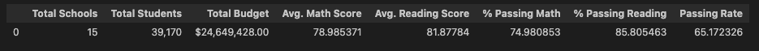

## School Summary
- School name
- School type
- Total students
- Total school budget
- Per student budget
- Average math score
- Average reading score
- % passing math (the percentage of students who passed math)
- % passing reading (the percentage of students who passed reading)
- % overall passing (the percentage of students who passed math AND reading)

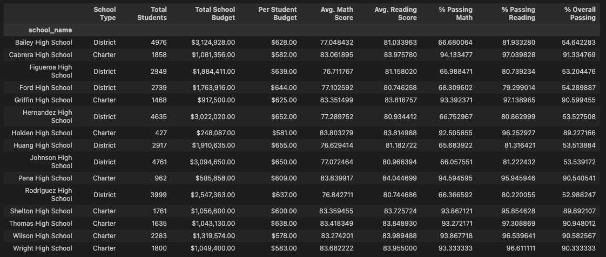

### Highest-Performing Schools (by % Overall Passing)
- Sort the schools by "% Overall Passing" in descending order to display the top 5 rows.

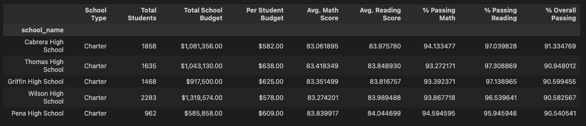

### Lowest-Performing Schools (by % Overall Passing)
- Sort the schools by "% Overall Passing" in ascending order to display the top 5 rows.

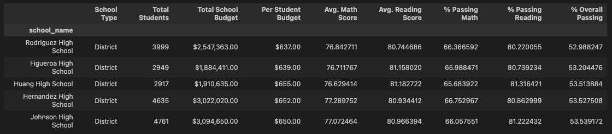

### Math Scores by Grade
Perform calculations to create a DataFrame that lists the average math score for students for each grade level(9th, 10th, 11th, 12th) at each school.

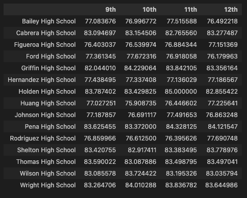

### Reading Scores by Grade
Perform calculations to create a DataFrame that lists the average reading score for students for each grade level(9th, 10th, 11th, 12th) at each school.

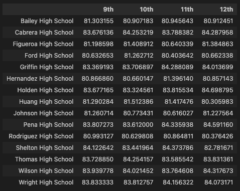

### Scores by School Spending
Create a table that breaks down school performance based on average spending ranges (per student).

**Included the following metrics in the table:**
- Average math score
- Average reading score
- % passing math (the percentage of students who passed math)
- % passing reading (the percentage of students who passed reading)
- % overall passing (the percentage of students who passed math AND reading)

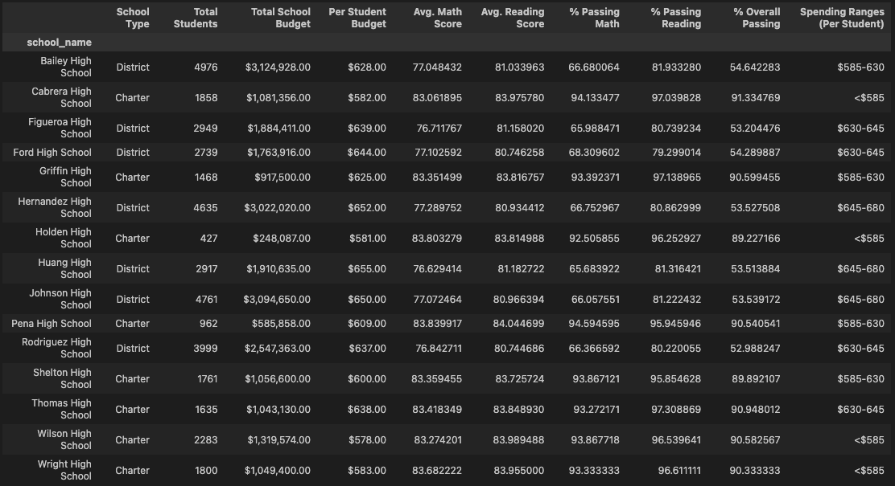

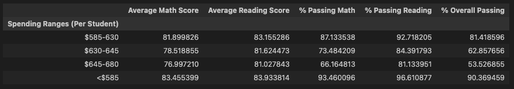

### Scores by School Size
Create a DataFrame that breaks down school performance based on school size (small, medium, or large) using the bins provided

size_bins = [0, 1000, 2000, 5000]
labels = ["Small (<1000)", "Medium (1000-2000)", "Large (2000-5000)"]

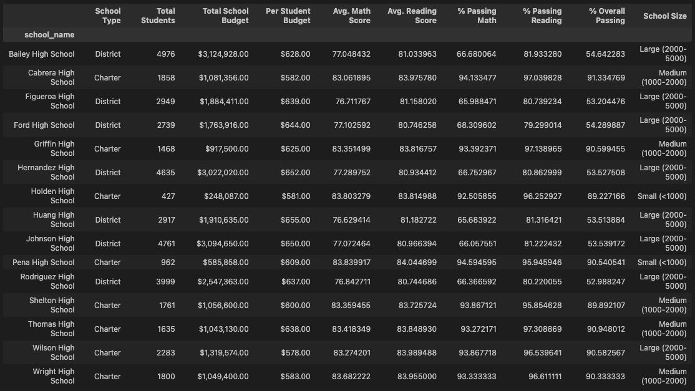

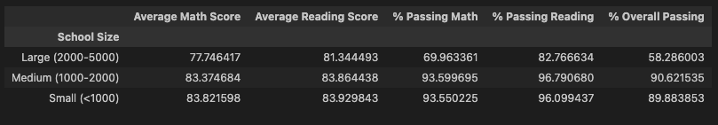

### Scores by School Type
Create a DataFrame to show school performance based on the "School Type".

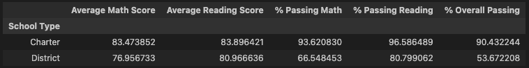